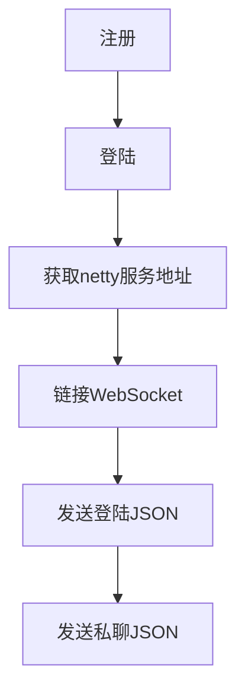

# IM应用实践

## 环境说明

- `JDK 8`
- `gradle 6.6.1`
- `SpringBoot 2.3.5.RELEASE`
- `Spring Cloud Hoxton.SR8`
- `Zookeeper 3.6`
- `MySQL 8`
- `Redis 6`

```shell script
docker run --name zookeeper3.6 -p 2181:2181 --restart always -d zookeeper:3.6
docker run --name redis6 -p 6379:6379 -d redis:6 redis-server --appendonly yes
docker run --name mysql8 -p 3306:3306 -e MYSQL_ROOT_PASSWORD=password -d mysql:8
```

**中间件均以`Docker`启动**


## 架构说明

以`Zookeeper`作为`netty`实例的注册中心，实现水平扩展，`router`模块负载均衡返回`netty`实例

## 模块说明

- `im-common`一些工具类以及公共类
- `im-netty` `netty`服务
- `im-router` `netty`服务的对外接口
- `im-backend`业务处理后端

## TODO

- [X] 私聊
- [x] 群聊
- [ ] 心跳检测

## 一个完整的流程

- `WebSocket path /my-im`

### 私聊



### 群聊


